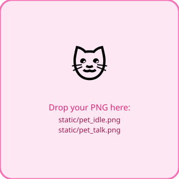

# StreamPet

A fully self-hosted Twitch stream overlay pet. Viewers type `!ask <question>` in chat and the pet responds with a spoken, animated reply — generated entirely on your local machine. No cloud APIs required.



---

## Features

- **`!ask` command** — viewers ask questions, the pet answers live in chat and on stream
- **Local LLM** — powered by [Ollama](https://ollama.com) (llama3.2 by default)
- **Local TTS** — [Piper TTS](https://github.com/rhasspy/piper) for fast, offline speech synthesis
- **OBS Browser Source** — transparent overlay with animated mouth-open/closed PNG swap
- **SSH/headless friendly** — runs on a headless Linux VM, OBS connects over LAN
- **Systemd service** — starts at boot, no login required

---

## Requirements

- Linux (Ubuntu/Debian-based)
- NVIDIA GPU recommended (RTX 3060 12 GB tested) — CPU-only works but is slower
- Python 3.10+
- `python3-venv` (`sudo apt install python3-venv`)
- A Twitch account for the bot (can be your main account or a dedicated bot account)

---

## Quick Start

### 1. Prepare the VM (first time only)

```bash
sudo bash prepare_vm.sh
```

Installs NVIDIA drivers, Python venv support, opens firewall port 8765, then reboots.

### 2. Install dependencies

```bash
./install.sh
```

Creates a Python virtualenv, installs packages, downloads Piper TTS and the voice model, installs Ollama, and pulls llama3.2.

### 3. Configure

```bash
cp .env.example .env
nano .env
```

Fill in `TWITCH_USERNAME` and `TWITCH_CHANNEL`. Leave `TWITCH_TOKEN` for the next step.

### 4. Get your Twitch credentials

1. Go to [https://dev.twitch.tv/console](https://dev.twitch.tv/console) — log in as your **bot** account
2. Click **Register Your Application**
   - Name: `StreamPet` (or anything you like)
   - OAuth Redirect URL: `http://localhost:17563`
   - Category: `Chat Bot`
3. Click **Create → Manage**, copy the **Client ID**
4. Click **New Secret**, copy the **Client Secret**
5. Paste both into `.env`, then run:

```bash
python3 get_token.py
```

The script handles the full OAuth flow and writes `TWITCH_TOKEN` to `.env` automatically. SSH/headless mode is detected automatically.

### 5. Add your pet images

Drop two PNG files into `static/`:

```
static/pet_idle.png   ← mouth closed (default)
static/pet_talk.png   ← mouth open (shown during TTS)
```

From your local machine:
```bash
scp pet_idle.png pet_talk.png user@your-vm-ip:~/streampet/static/
```

Placeholder images are generated automatically if you skip this step.

### 6. Run

```bash
./start.sh
```

Or install as a persistent system service (starts at every boot):

```bash
sudo bash setup_service.sh
```

### 7. Add OBS Browser Source

- URL: `http://<your-vm-ip>:8765`
- Enable: **Control audio via OBS**

---

## Configuration

All settings live in `.env`. Key options:

| Variable | Description | Default |
|----------|-------------|---------|
| `TWITCH_USERNAME` | Bot account username | — |
| `TWITCH_CHANNEL` | Your channel name (no `#`) | — |
| `PET_NAME` | Pet's name used in LLM prompt | `Pixel` |
| `PET_PERSONALITY` | System prompt personality | friendly, concise |
| `OLLAMA_MODEL` | Ollama model to use | `llama3.2` |
| `COOLDOWN_SECONDS` | Per-user cooldown for `!ask` | `15` |
| `MAX_TOKENS` | Max LLM response length | `150` |
| `SERVER_PORT` | HTTP/WebSocket port for OBS | `8765` |

---

## Architecture

```
Twitch chat → TwitchIO bot
                  ↓
            Ollama LLM (localhost:11434)
                  ↓
            Piper TTS → static/audio/<uuid>.wav
                  ↓
            WebSocket broadcast
                  ↓
            OBS Browser Source
              (PNG swap animation + audio playback)
```

Single asyncio process — `main.py` runs FastAPI (uvicorn) and the TwitchIO bot concurrently via `asyncio.gather()`.

---

## Service Management

```bash
sudo systemctl status streampet      # check status
sudo journalctl -u streampet -f      # live logs
sudo systemctl restart streampet     # restart after .env changes
sudo bash remove_service.sh          # uninstall the service
```

---

## PDF Setup Guide

A comprehensive setup guide is included:

```bash
# View it on your local machine after scp'ing it over:
scp user@your-vm-ip:~/streampet/StreamPet_Setup_Guide.pdf .

# Or regenerate it:
python3 generate_guide.py
```

---

## License

MIT
